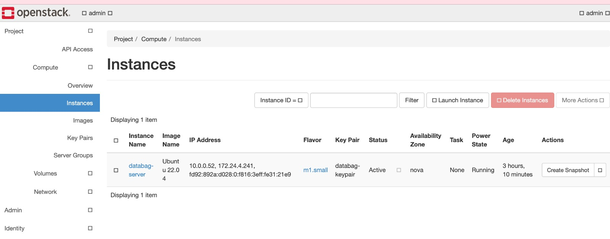
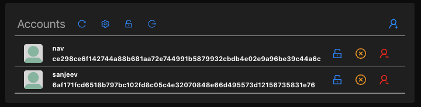
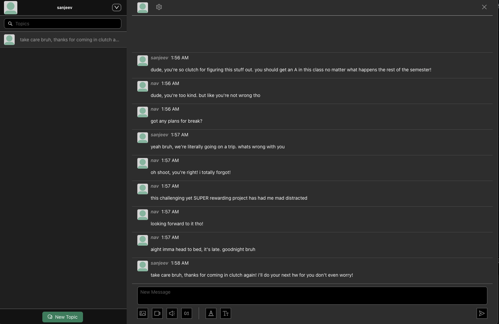

[](https://classroom.github.com/a/YgTxS8yH)

# Arnav Menon (arnavmen) & Sanjeev Sridhar (ssridha3)

## Devstack Installation

Installation was pretty simple. We used [this](https://docs.openstack.org/devstack/latest/) guide, and followed the steps, and everything went pretty smoothly. 

To use devstack on the VM, follow these steps.

1. `sudo -u stack -i` we need to switch to the user you created during devstack installation. if you followed the guide exactly, the user should be `stack`, but replace with your username.
2. cd into the `devstack` folder and run `source openrc`. this will load the env variables required to interact with openstack CLI.
3. run any/all of the following commands as a sanity check to make sure openstack CLI is working.
```
openstack service list
openstack endpoint list
openstack server list
openstack network list
openstack image list
openstack volume list
```

## Access Devstack Dashboard from Local Machine
These steps will create an ssh tunnel from your local machine to the vm openstack is hosted on and allow you to interact with the openstack dashboard from your local machine. Only necessary if your vm doesn't have a GUI.

1. First we need to generate an SSH key pair on local machine. Run this command
```
ssh-keygen -t rsa -b 4096
```
The .pub file is your public key. Copy the contents of it and paste it into the `~/.ssh/authorized_keys` file. ssh into your vm, open the file, and paste the public key into it.

2. Now we can create the ssh tunnel from our local machine to the vm. command is as follows
```
ssh -L <local_port>:<vm_public_ip>:<vm_port> <user>@<external_ip>
```
Replace:
  - `<local_port>` with the port you want to use on your local machine.
  - `<vm_public_ip>` with your VM’s public IP.
  - `<vm_port>` with the port on the VM you want to forward, usually port `80`
  - `<user>` with your VM username, in our case `stack`
  - `<external_ip>` with the VM’s external IP.

3. you should be able to access `http://localhost:<local_port>` on your local machine and be prompted to login to the openstack dashboard. once logged in you should see an interface similar to this


## Creating VM Instance via Terraform in Openstack
This part wasn't too bad. We were able to create the VM instance with terraform very easily, but we were having trouble ssh'ing into it. after scouring documentation and videos online, as well as talking to the prof, we realized that our vm was hosted in one network within openstack but our user was in another. Once we fixed that we were able to ssh in.

## Deploy Databag
I'll quickly walk through how we deployed databag. Followed [this](https://github.com/balzack/databag/blob/main/doc/aws.md) guide. We ran all those steps as recommended, but skipped step 6 (mounting volumes to cloud instance) as we aren't really concerned with that rn. we just wanted to get databag working ASAP. One thing we had to do was to create a new firewall rule to allow traffic on port 8080. That's the main port databag was trying to communicate via and we didn't have a rule allowing for that communication. After we figured that out, we were able to run the following command to get databag up and running.
```
sudo nice -n -5 /usr/local/go/bin/go run databag -p 8080 -s /var/lib/databag -w /app/databag/net/web/build -t /opt/databag/transform -b 0.0.0.0
```
***NOTE***: run this command from `/app/databag/net/server` directory.

We aren't worried about any security stuff right now as, again, we wanted to get this up and running quickly. 

Once that command is run databg is up and running and you should be able to access the site, same as before with ssh tunneling. Here are a couple screenshots of the admin account looking at the list of users registered on the site and a conversation between those two users.


